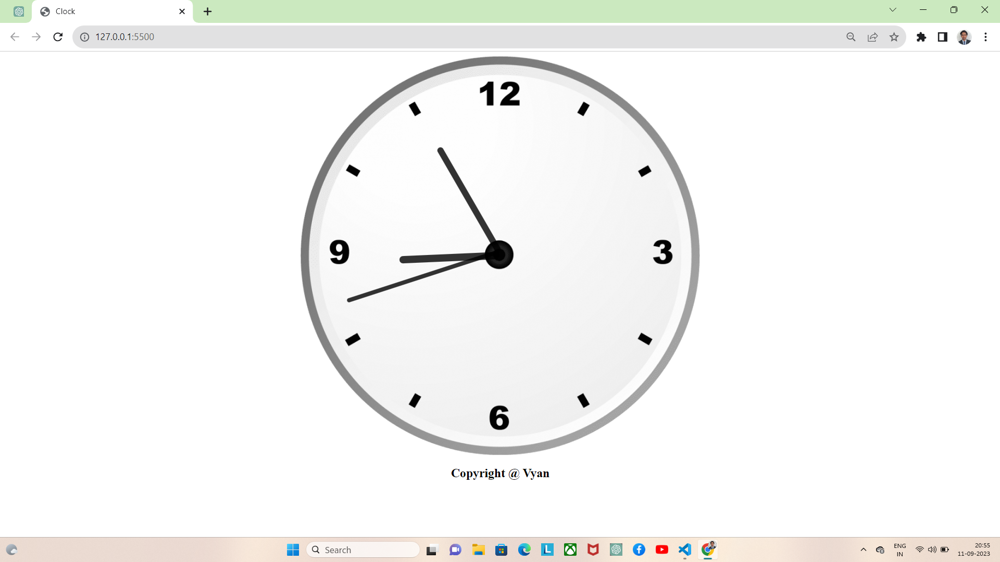

# Clock Animation with JavaScript

A simple JavaScript script to create a dynamic clock animation using HTML, CSS, and JavaScript.

## Table of Contents

- [Demo](#demo)
- [Features](#features)
- [Getting Started](#getting-started)
- [Usage](#usage)
- [Customization](#customization)
- [Contributing](#contributing)
- [License](#license)

## Demo

You can see a live demo of this clock animation [here](link-to-live-demo).

## Features

- Real-time clock animation.
- Displays the current time with hour, minute, and second hands.
- Smooth and continuous animation using JavaScript's `setInterval`.
